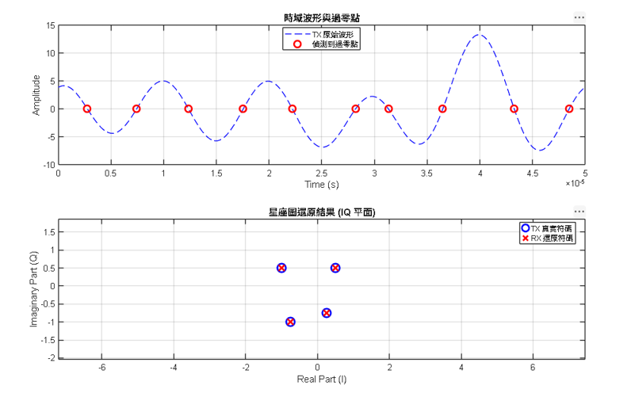

# 基於零點遷移與韋達定理之 ZCD-OFDM 電路與演算法

[](https://www.mathworks.com/)
[](https://ndltd.ncl.edu.tw/)

本專案為一個端到端的**零點遷移** MATLAB 模擬系統。

---

## 核心演算法五大步驟

其運作流程如下：

### Step 1: 物理波形與代數多項式的映射 
利用歐拉公式，將連續流逝的時間 $t$ 轉換為在複數平面單位圓上旋轉的角度變數 $z$：
$$z = e^{j 2\\pi f_0 t}$$
此時，不同頻率的子載波波形 $e^{j 2\\pi k f_0 t}$ 就變成了多項式的變數次方的形式: $z^k$ ,而我們要傳送的 16-QAM 複數符碼 $a_k$ 則變成了該多項式的「係數 (Coefficients)」：
$$s(z) = a_{M+1}z^{M+1} + a_M z^M + \\dots + a_1 z^1$$

### Step 2: 零點遷移定理 
並非所有多項式方程式的根都會剛好落在單位圓上。如果根跑進圓內或圓外，在物理時間軸上就無法產生「過零點」（電壓歸零的瞬間），接收端便無法量測。
本系統引入當最高次項的係數振幅，大於等於其餘所有係數絕對值總和的一半時，所有根會被強制拉回單位圓周：
$$|a_{M+1}| \\ge \\frac{1}{2}\\sum_{k=1}^{M}|a_k|$$
在實作上，發射端（TX）會在最高頻處疊加一個能量極強的「強載波 」，強迫時域波形密集、規律地穿越 0 伏特水平線。

### Step 3: 韋達定理重建多項式 
接收端比較器精準量測到所有的過零時間 $t_k$ 後，先透過 $r_k = e^{j 2\\pi f_0 t_k}$ 反向映射回單位圓上的複數根，再利用韋達定理（根與係數的關係）將所有根相乘展開：
$$P(z) = (z - r_1)(z - r_2)(z - r_3)\\dots(z - r_{2M+2}) = 0$$
展開後得到的各項係數，即對應系統混合後的訊號特徵（MATLAB 程式碼中以 `poly()` 函數實作）。

### Step 4: 共軛倒數特性的資料提取 
由於天線只能發射純實數電壓，該多項式具備共軛倒數（鏡像對稱）的代數特性。展開後的係數陣列長相如下$`[a_5, \ a_4, \ a_3, \ a_2, \ a_1, \ DC, \ a_1^*, \ a_2^*, \ a_3^*, \ a_4^*, \ a_5^*]`$
接收端只需進行簡單的陣列切割，切出右半邊的共軛部分$`[a_1^*, \ a_2^*, \ a_3^*, \ a_4^*, \ a_5^*]`$，再執行一次共軛（`conj()`），最原始的複數資料 $a_1 \\dots a_M$ 即可完美重現。這項特性讓接收端能完全省去處理虛部（Q 訊號）的硬體電路！

---


## 程式碼解析

### 1. 參數設定
*   `f0 = 20e3` ($20\text{ kHz}$)：基頻頻率。
*   `M = 4`：總共調變 4 個複數資料子載波。
*   `fs = 1000 * f0 * (M+1)`：**1000 倍的過取樣**，目的是為了在模擬時能精準抓到「穿過零伏特」的瞬間時間點。
*   `t`：時間軸，長度為一個完整符號週期 $T$。

---

### 2. TX 發射端
*   **輸入來源：** `ak_truth` 爲 4 個隨機給定的複數基頻符碼（對應子載波 1 到 4）。
*   > 「為了讓時域波形的過零點與多項式的根建立『一對一』的對應關係，我們必須滿足**韋達還原的充分條件**——所有根必須落在單位圓上。因此，我們計算出強載波 `aM_carrier` 的振幅，必須大於等於其餘所有係數絕對值總和的一半（多加一個安全k數值 $+1$）。」
*   **波形合成：**
    *   因模擬子載波數量少(通常使用IFFT)，可直接利用 `2 * real(...)` 合成，把 4 個子載波的訊號疊加。取實部real()在頻譜上的物理意義，代表我們同時加入了 $a_k$ 與其共軛對稱項 $a_k^*$，這使得最後合成出來的時域波形 `rx_signal` 是一個**純實數波形**。
    *   最後在最高頻率（第 $M+1$ 個子載波）補上剛剛算好的強載波。

---

### 3. RX 接收端
*   **過零點定位：**
    *   使用 `find(rx_signal(1:end-1) .* rx_signal(2:end) < 0)` 尋找相鄰兩個時域訊號相乘為負的索引。這代表訊號剛好在這個瞬間「穿過 0 伏特」（正變負，或負變正）。
*   **線性內插：**
    *   因為取樣點是離散的，真正的零點通常落在兩個取樣點之間。這裡利用相似三角形的比例關係：
        $$\Delta t = \frac{0 - y_1}{y_2 - y_1} \cdot dt$$
        求出連續時間下的過零點時間 $t_k$（即程式中的 `tk_measured`）。
*   **輸出：** 得到總共 $2(M+1) = 10$ 個精準的過零點時間。

---

### 4. 韋達定理還原 (Vieta Reconstruction)
*   **單位圓映射：**
    *   將時域偵測到的時間 $t_k$，透過映射公式 $r_k = e^{j 2\pi f_0 t_k}$ 映射回複數平面，這些 $r_k$ 就是多項式的**根（Roots）**。
*   **多項式展開：**
    *   MATLAB 的 `poly(rk)` 函數底層就是將根展開成多項式：
        $$P(z) = \prod (z - r_k) = p_0 z^N + p_1 z^{N-1} + \dots + p_N$$
        其係數就是透過韋達定理（根與係數的關係）由根計算出來的。
*   **Scaling修正：**
    > 我們只要拿已知發射端的強載波 `aM_carrier` 除以還原出的首項 `p_recon(1)`，就能還原出多項式係數 `p_scaled`」
*   **信號提取：**
    *   因為實數訊號具有「共軛倒數」的多項式特徵，多項式係數會是對稱的。我們切出中間偏右、對應原本子載波頻率的區塊 `conj_part`，重新取共軛轉置（`conj(conj_part).'`），就得到了解調後的複數符碼 `ak_recovered`。

---

### 5. 視覺化驗證結果
*   **圖一（時域波形）：** 證明 ZCD 搭配線性內插，確實抓到了波形穿過 0 的點。
*   **圖二（星座圖）：** 紅色的 `X`（接收端還原）與藍色的 `O`（發射端真實）幾乎重疊。
*   命令列輸出 `誤差: 1.12e-13`。

---

## 驗證





```mermaid
graph TD
    %% 定義風格
    classDef txStyle fill:#e1f5fe,stroke:#01579b,stroke-width:2px,color:black;
    classDef chStyle fill:#fff3e0,stroke:#e65100,stroke-width:2px,color:black;;
    classDef rxStyle fill:#e8f5e9,stroke:#1b5e20,stroke-width:2px,color:black;

    %% 發射端流程 (使用 span 標籤將字體強制設為黑色)
    subgraph TX 發射端 TX - 訊號建構與零點遷移
        A[原始資料 16-QAM<br>複數符碼 a1 ~ a4]-->|Step 1: 分配子載波| C[強載波計算 a5<br>]  
        C -->|Step 3: 鎖定單位圓| E[多載波調變與訊號合成<br> IFFT 運算]
    end

    %% 通道流程
    E -->|發射實數時域波形 s_tx| CH[RX 接收]

    %% 接收端流程 (使用 span 標籤將字體強制設為黑色)
    subgraph RX 接收端 RX - 量測過零點與資料還原
        CH -->F[線性內插,找出穿過 0 伏特的瞬間時間 tk<br>]
        F --> |尤拉公式轉換| G[tk 時間映射複數平面單位圓上的根 rk<br>]
        G -->|單位圓上的複數根rk| H[韋達定理展開 poly<br>]
        H -->|輸出多項式 p_recon| I[利用已知 a5 校正 p_recon<br> ]
        I -->|校正後多項式 p_scaled| J[共軛倒數提取<br>切出右半邊陣列]
        J -->|共軛切片 ［a1*, a2*, a3*, a4*］| K[共軛運算 conj<br>還原原始資料]
    end

    %% 套用風格 (已移除未定義的 B, D 節點避免報錯)
    class A,C,E txStyle;
    class CH chStyle;
    class F,G,H,I,J,K rxStyle;
